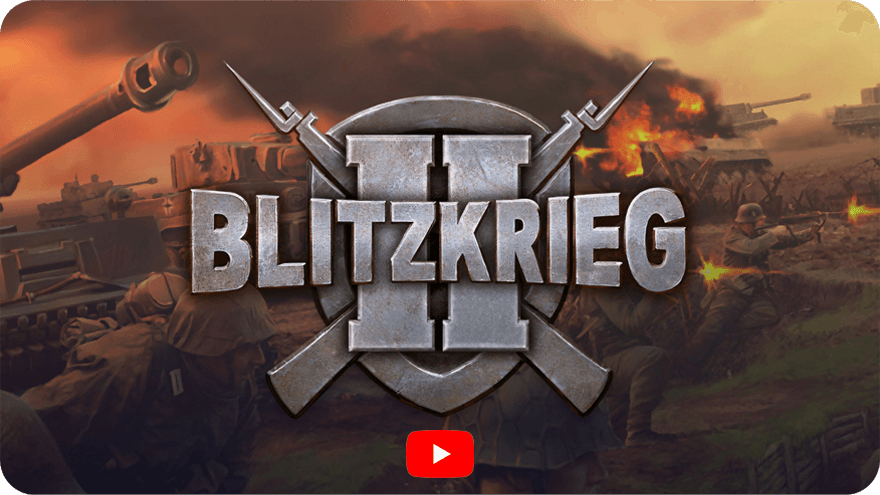

[English](README.md)        [Русский](README_Russian.md)        [中文](README_Chinese.md)        [हिन्दी](README_Hindi.md)        [Español](README_Spanish.md)        [Français](README_French.md)        [Deutsch](README_German.md)        [Português](README_Portuguese.md)        [日本語](README_Japanese.md)        [Bahasa Indonesia](README_Indonesian.md)

The computer game [Blitzkrieg 2](https://en.wikipedia.org/wiki/Blitzkrieg_2) is the second installment of the legendary series of real-time strategy war games, developed by [Nival Interactive](http://nival.com/) and released in 2005.

The game is still available on [Steam](https://store.steampowered.com/app/313500/Blitzkrieg_2_Anthology) and [GOG.com](https://www.gog.com/en/game/blitzkrieg_2_anthology).

In 2025, the game's source code was released under a [special license](LICENSE.md) that prohibits commercial use but is completely open for the game's community, education and research.
Please review the terms of the [license agreement](LICENSE.md) carefully before using it.

## Tech stack

- **Game engine**: Custom 3D engine, mostly written in C++
- **Scripting language**: Lua
- **Animation**: Granny Animation (RAD Game Tools) ⚠️ *Commercial license - not included*
- **Video**: Bink Video Technology ⚠️ *Commercial license - not included*
- **Audio**: FMOD sound system ⚠️ *Commercial license - not included*

## What is in this repository

- `Complete` — game data and resources
- `Design` — design documents and art resources  
- `Soft` — source code and development tools
- `Sound` — game sound resources
- `Tools` — development and build tools
- `Localizations` — localization files
- `Versions` — different build configurations and testing environments
- `Versions/Temporary/Engine/Sources` — complete game engine source code

---

# Running the game

## Basic launch
1. Navigate to the `Complete/bin/` directory
2. Run the game executable (if available)

---

# Map editor and development tools

## Map editor
- **Location**: `Complete/Editor/`
- **Documentation**: `Design/Manuals/MapEditorManual/`
- **Manual**: `Design/Manuals/MapEditorManual/Final/`
- **FAQ**: `Design/Manuals/MapEditorManual/FAQ/`

## Development tools
- **Maya plugins**: `Tools/MayaScripts/`
- **Texture converters**: `Tools/TexConv.exe`, `Tools/DxTex.exe`
- **Font generator**: `Tools/FontGen.exe`
- **Granny tools**: `Tools/Granny/`

---

# Building the project

## Build requirements
- Microsoft Visual Studio (2003)
- DirectX SDK
- Additional dependencies are specified in the documentation

---

## License Information

This project is released under a **special non-commercial license** from NIVAL INTERNATIONAL LTD.

### ✅ What's included and open source:
- **Game engine source code** - Custom license from NIVAL INTERNATIONAL LTD (non-commercial use only)
- **zlib compression library** - zlib License (permissive, commercial use allowed)
- **Game scripts, assets, and data** - Custom license from NIVAL INTERNATIONAL LTD (non-commercial use only)

### ⚠️ Additional tools not included in source code:
- **FMOD Audio System**
- **Bink Video Technology**
- **Granny3D Animation System**
- **Stingray Studio UI Components**
- **MySQL Database**
- **S3TC Texture Compression**

### 📋 Third-party licenses:
- **zlib** (v1.1.3) - Copyright (C) 1995-1998 Jean-loup Gailly and Mark Adler - zlib License

Please review the complete [license agreement](LICENSE.md) before using this code.

