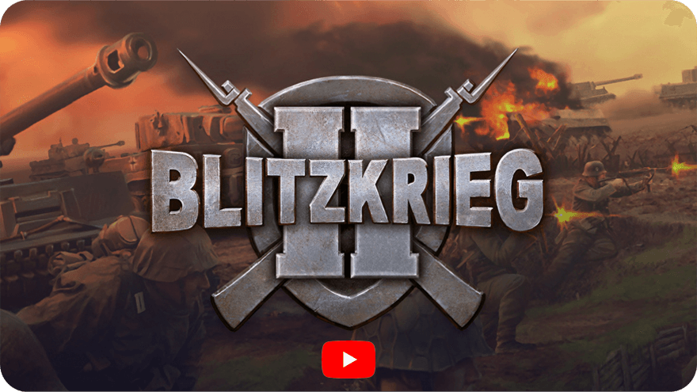

[English](README.md)        [Русский](README_Russian.md)        [中文](README_Chinese.md)        [हिन्दी](README_Hindi.md)        [Español](README_Spanish.md)        [Français](README_French.md)        [Deutsch](README_German.md)        [Português](README_Portuguese.md)        [日本語](README_Japanese.md)        [Bahasa Indonesia](README_Indonesian.md)

Permainan komputer [Blitzkrieg 2] adalah seri kedua dari seri legendaris permainan strategi perang real-time, dikembangkan oleh [Nival Interactive] dan dirilis tahun 2005.

Permainan ini masih tersedia di [Steam] dan [GOG.com].

Pada tahun 2025, kode sumber permainan dirilis di bawah [special license] yang melarang penggunaan komersial tetapi sepenuhnya terbuka untuk komunitas permainan, pendidikan, dan penelitian. Harap tinjau dengan cermat ketentuan dalam [license agreement] sebelum menggunakannya.

## Tumpukan teknologi

- Mesin game: mesin 3D kustom, sebagian besar ditulis dengan C++
- Bahasa skrip: Lua
- **Animasi**: Granny Animation (RAD Game Tools) ⚠️ *Lisensi komersial - tidak disertakan*
- **Video**: Bink Video Technology ⚠️ *Lisensi komersial - tidak disertakan*
- **Audio**: FMOD sound system ⚠️ *Lisensi komersial - tidak disertakan*

## Apa yang ada di repositori ini

- `Complete` — data dan aset permainan
- `Design` — dokumen desain dan aset seni
- `Soft` — kode sumber dan alat pengembangan
- `Sound` — sumber daya audio permainan
- `Tools` — alat untuk pengembangan dan build
- `Localizations` — file lokalisasi
- `Versions` — berbagai konfigurasi build dan lingkungan pengujian
- `Versions/Temporary/Engine/Sources` — kode sumber lengkap mesin permainan

---

# Menjalankan permainan

## Peluncuran dasar  
1. Buka direktori `Complete/bin/`  
2. Jalankan file executable permainan (jika tersedia)  

---

# Editor peta dan alat pengembangan

## Editor peta  
- Lokasi: `Complete/Editor/`  
- Dokumentasi: `Design/Manuals/MapEditorManual/`  
- Panduan: `Design/Manuals/MapEditorManual/Final/`  
- FAQ: `Design/Manuals/MapEditorManual/FAQ/`  

## Alat pengembangan  
- Plugin Maya: `Tools/MayaScripts/`  
- Konverter tekstur: `Tools/TexConv.exe`, `Tools/DxTex.exe`  
- Generator font: `Tools/FontGen.exe`  
- Alat Granny: `Tools/Granny/`  

---

# Membangun proyek

## Persyaratan build  
- Microsoft Visual Studio (2003)  
- DirectX SDK  
- Dependensi tambahan tercantum dalam dokumentasi

---

## Informasi lisensi

Proyek ini dirilis di bawah **lisensi khusus non-komersial** dari NIVAL INTERNATIONAL LTD.

### ✅ Yang disertakan dan open source:
- **Kode sumber mesin game** - Lisensi kustom dari NIVAL INTERNATIONAL LTD (hanya penggunaan non-komersial)
- **Pustaka kompresi zlib** - Lisensi zlib (permisif, penggunaan komersial diizinkan)
- **Skrip, aset, dan data game** - Lisensi kustom dari NIVAL INTERNATIONAL LTD (hanya penggunaan non-komersial)

### ⚠️ Alat tambahan yang tidak disertakan dalam kode sumber:
- **FMOD Audio System**
- **Bink Video Technology**
- **Granny3D Animation System**
- **Stingray Studio UI Components**
- **MySQL Database**
- **S3TC Texture Compression**

### 📋 Lisensi pihak ketiga:
- **zlib** (v1.1.3) - Copyright (C) 1995-1998 Jean-loup Gailly and Mark Adler - Lisensi zlib

Silakan tinjau [perjanjian lisensi](LICENSE.md) lengkap sebelum menggunakan kode ini.  

